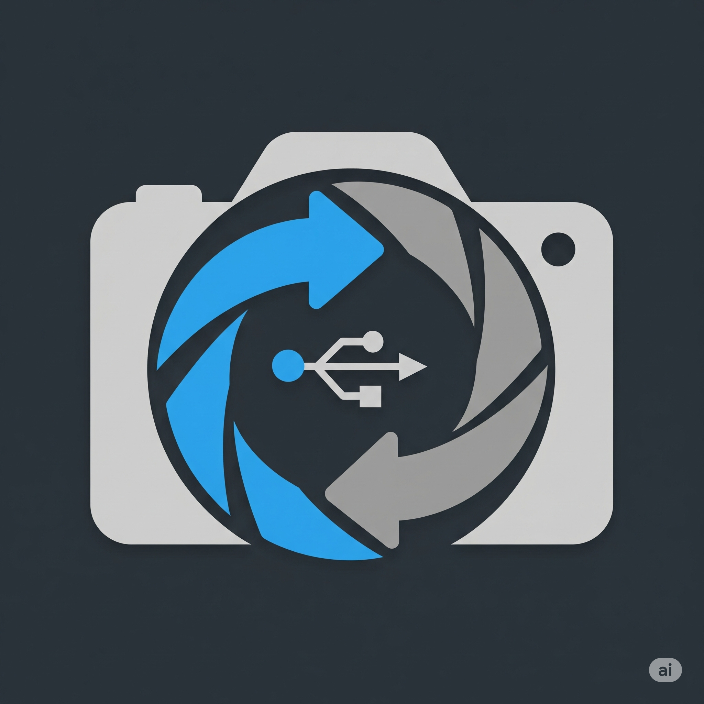
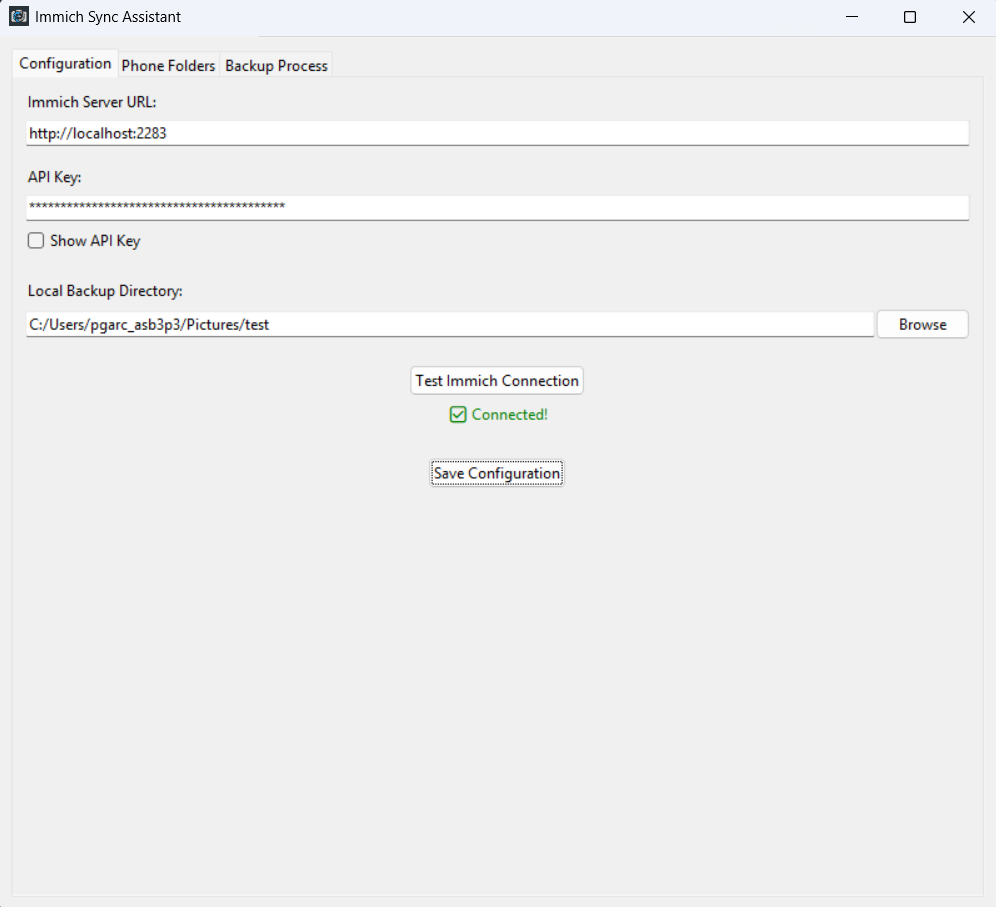

# 📸 Immich Sync Assistant (GUI)

<p align="center">
  
</p>

A simple, cross-platform Python tool that pulls photos and videos from an Android device via **ADB**, then uploads them to your **Immich server** using the Immich API, with a friendly **GUI interface** and a powerful, customizable post-sync workflow.

> ⚠️ **Disclaimer:** This application is currently under development. While it has been tested, there is always a risk of bugs or unexpected behavior. Please **always back up your important photos and videos** through another method before using the cleanup features of this tool. The developer is not responsible for any data loss.

---

## ✨ Core Features

This project was built with a focus on efficiency, user control, and robustness.

* 🔌 **Direct ADB Connection:** Transfers files directly from your phone to your PC via USB. No Wi-Fi or cloud intermediaries are needed, ensuring speed and privacy.
* 🧠 **Intelligent Duplicate Detection:** Leverages the Immich API's hashing mechanism to intelligently detect and skip files that already exist on your server, preventing redundant uploads and saving storage space.
* 🗂️ **Selective Folder Syncing:** A file explorer allows you to browse your phone's directories and select exactly which folders (e.g., `DCIM/Camera`, `Pictures/Screenshots`) you want to include in the sync process.
* 🤖 **Automated Album Organization:** Automatically organizes uploaded media into albums within Immich. It can create albums based on the source folder names or a custom name you provide for each batch.
* ⚙️ **Robust Post-Sync Workflow:**
    * 🧹 **Phone Cleanup:** Optionally delete files from your Android device after a successful upload to free up space.
    * 🗜️ **Local Backup:** Automatically compresses the pulled media into a single `.zip` archive on your PC for safekeeping.
    * 🧽 **PC Cleanup:** Optionally delete the local copies of the files from your PC once they are uploaded to Immich and archived.
* 🌐 **Cross-Platform GUI:** Built with Python's standard **Tkinter** library, ensuring it runs on Windows, macOS, and Linux without extra dependencies.
* 🔒 **Secure Configuration Management:** All your settings, including your Immich URL and API Key, are saved locally to a `config.json` file for easy reuse. The API key is masked in the UI by default.
* 🔄 **Responsive Multi-threaded Operations:** Long-running tasks like scanning the phone's file system and the backup process are handled in separate threads to keep the user interface responsive at all times.

---

## 🚀 Quick Start (Windows Executable)

For users who don't want to install Python and its dependencies, a pre-compiled version for Windows is available.

1.  **Download the latest release:** Go to the **[Releases Page](https://github.com/PabloG55/immich_sync_assistant/releases)** and download the `immich_sync_assistant.zip` file. 
2.  **Extract the ZIP file:** Unzip the downloaded file to a folder on your computer.
3.  **Run the application:** Open the extracted folder, navigate into the `dist` folder, and double-click `gui.exe` to start the Immich Sync Assistant.

---

## 👨‍💻 Developer Setup & Installation

For those who want to run the application from the source code.

### 📋 Prerequisites

Before you begin, ensure you have the following setup:

1.  **Python 3.8+** installed on your computer.
2.  **Android Debug Bridge (ADB)** installed and accessible from your command line/terminal. You can get this with the [Android SDK Platform Tools](https://developer.android.com/tools/releases/platform-tools).
3.  **An active Immich Server instance.** The most common way to run this is with Docker. Make sure it's up and running.
4.  **An Android device** with **USB Debugging enabled** in the Developer Options.

### ⚙️ Installation Steps

#### Step 1: Clone the Repository

Get the source code on your local machine.

```bash
git clone https://github.com/PabloG55/immich_sync_assistant
cd immich_sync_assistant
```
*(Remember to replace `your-username` and `your-repo-name`)*

#### Step 2: Install Dependencies

This project uses `requests` for API calls and `piexif` for handling image metadata. Install them using the `requirements.txt` file.

```bash
pip install -r requirements.txt
```

#### Step 3: Get Your Immich API Key

You'll need an API key to allow the application to communicate with your Immich server.

1.  Log in to your Immich web interface.
2.  Go to **Account Settings** by clicking your user icon in the top right.
3.  Navigate to the **API Keys** section.
4.  Click **New API Key**, give it a name (e.g., "Sync Assistant"), and click **Create**.
5.  **Copy the generated API key immediately.** You will not be able to see it again.

#### Step 4: Run the Application

Once the setup is complete, you can launch the GUI from the source code.

```bash
python gui.py
```

---

## 📖 How to Use the Application

### 1. Configure Your Server Details

First, connect the application to your Immich server.

* **Immich Server URL:** Enter the full URL of your Immich instance (e.g., `http://192.168.1.100:2283`).
* **API Key:** Paste the key you generated in the setup steps.
* **Local Backup Directory:** Choose a folder on your PC where the files will be temporarily stored before being uploaded.
* Click **Test Immich Connection** to verify your details. If successful, click **Save Configuration**.



### 2. Select Phone Folders for Syncing

Connect your phone to your PC with a USB cable and ensure USB Debugging is authorized.

* Go to the **Phone Folders** tab.
* Click **Refresh Folders** to scan your device's storage.
* In the top pane, select a folder you want to sync.
* Click **Add Selected** to add it to the sync list in the bottom pane. You can also add a **Custom Path** if a folder is not found automatically.


### 3. Start the Backup Process

This is where the magic happens!

* Navigate to the **Backup Process** tab.
* **(Optional)** Enter a **Custom Album Name**. If you leave this blank, albums will be named after the phone's source folders (e.g., `Camera`, `Screenshots`).
* Click **Start Backup**.
* The log window will show the detailed progress: pulling files, checking for duplicates, uploading new files to Immich, and organizing them into albums.


### 4. Perform Post-Sync Cleanup (Optional)

After the upload is complete, you will be prompted with cleanup options. This gives you full control over your data. You can choose to:

1.  Delete the just-synced files from your phone.
2.  Delete the local copies from your PC (as they are now in Immich and a zip archive has been created).


### 5. Verify in Immich

Finally, open your Immich web interface. You will see your newly created album with all your freshly uploaded photos and videos!


---

## 📜 License

This project is licensed under the MIT License. See the [LICENSE](LICENSE) file for details.
